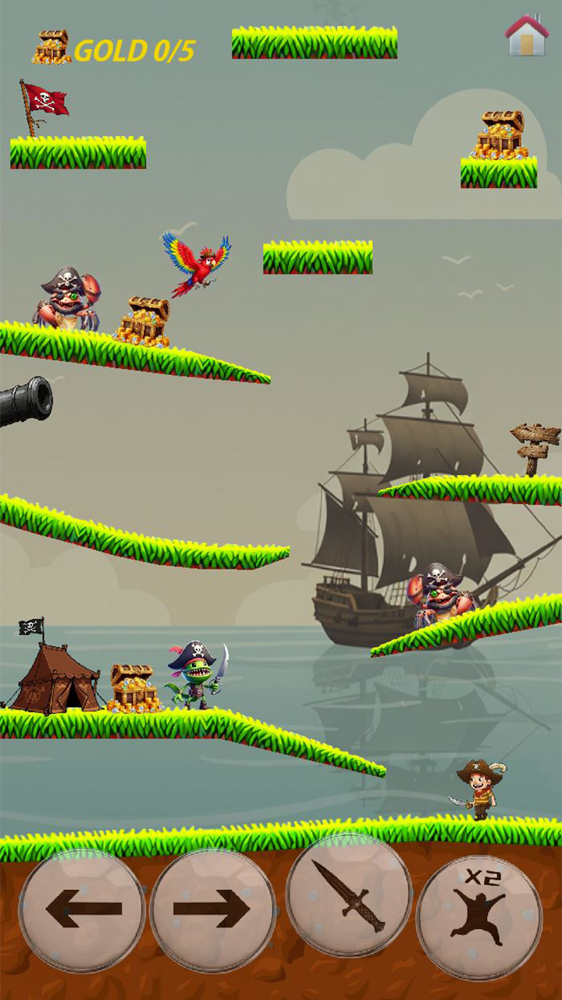
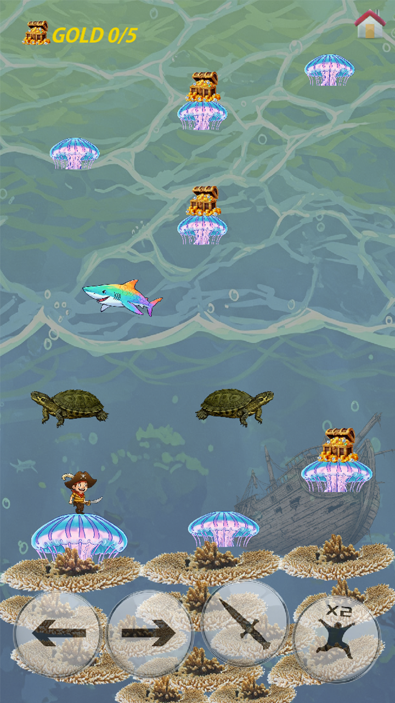
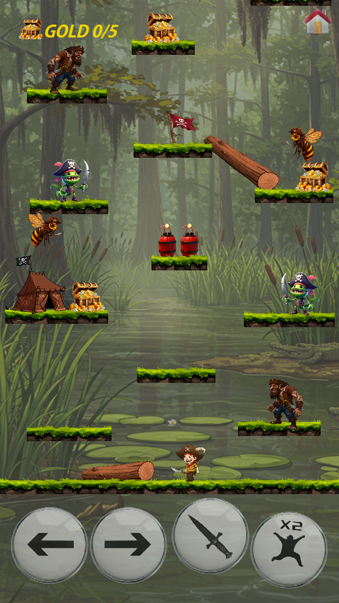
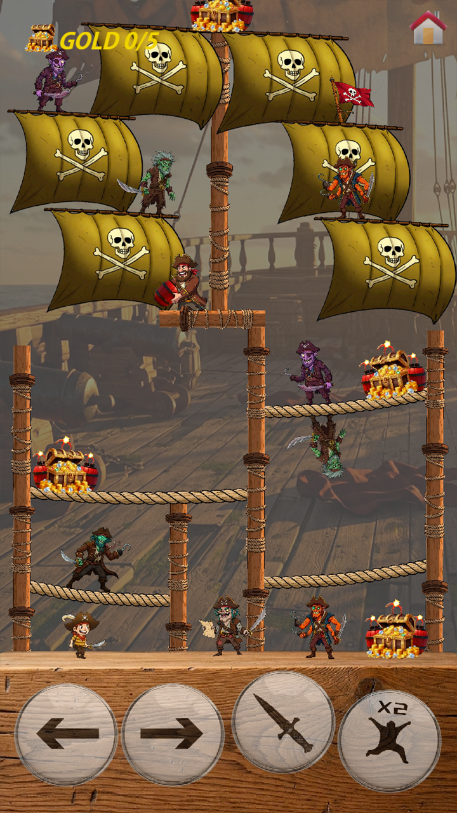

# [Kaptan Ege](https://crashentertainment.github.io/)&nbsp;&nbsp;&nbsp;&nbsp;&nbsp;&nbsp;&nbsp;&nbsp;&nbsp;&nbsp;&nbsp;&nbsp;[Privacy Policy](https://crashentertainment.github.io/privacypolicy)

  <iframe width="560" height="315" src="https://www.youtube.com/embed/wUXnHaUFbms?si=tPriBBIb1_EoFNSA" 
    title="YouTube video player" frameborder="0" allow="accelerometer; autoplay; clipboard-write; encrypted-media; gyroscope; picture-in-picture; web-share" 
    referrerpolicy="strict-origin-when-cross-origin" allowfullscreen>
  </iframe>

<!-- 📷 Resimlerin bulunduğu kapsayıcı -->

 
 
 
 
  <!-- İstersen daha fazla ekle -->

<!-- Modal -->

  &times;
  

